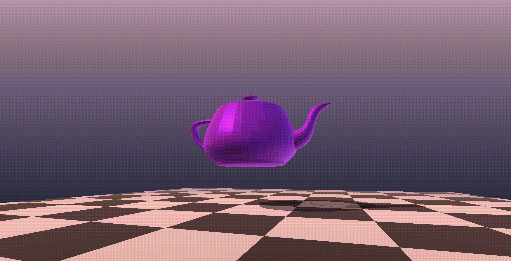

# liquidware



liquidware is a small browser-based WebGPU toy for composing glossy, low-poly renders with a retro CGI feel. Tweak the scene in real time, then switch to render mode to capture a stylized still with built-in post-processing.

## Run

```bash
npm install
npm run dev
```

## Build

```bash
npm run build
```

## Test

```bash
npm test
```

## Controls

- A floating toolbar overlaps the canvas; drag it by its handle to move it around.
- Rotate the scene via mouse drag, keyboard arrow keys or toolbar arrows.
- Use `load .obj` to replace the default cube with a local OBJ mesh, or `cube` to switch back.
- Imported OBJ files are auto-centered, auto-scaled, and currently support polygon faces with `v`, optional `vn`, and `f` records.
- Use the toolbar material controls to set the active mesh's single base color plus surface character, stylized gloss, and retro light bleed.
- `edit` shows the live WebGPU canvas and keeps rotation controls enabled.
- `render` captures a rasterized still of the current scene, applies some post-processing treatments, and provides `download` and `copy` options.
